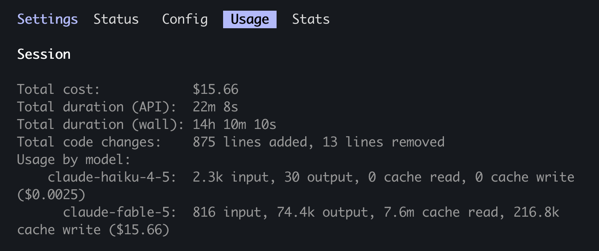
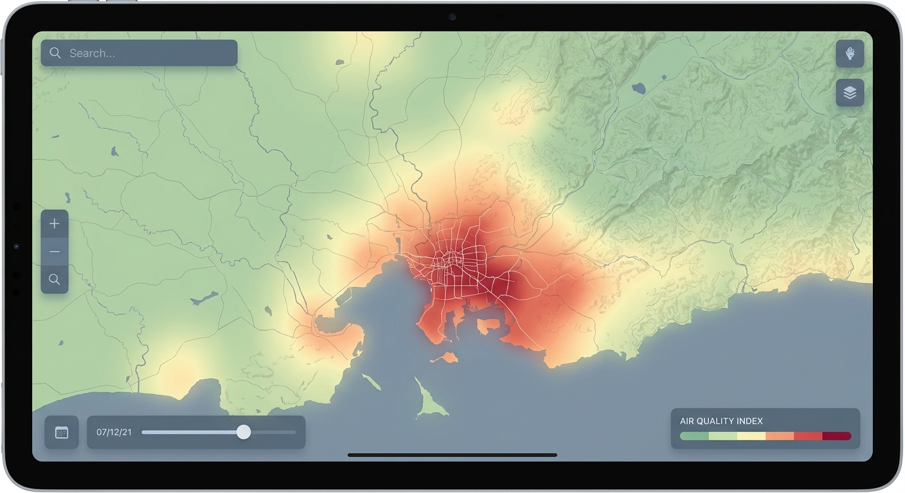
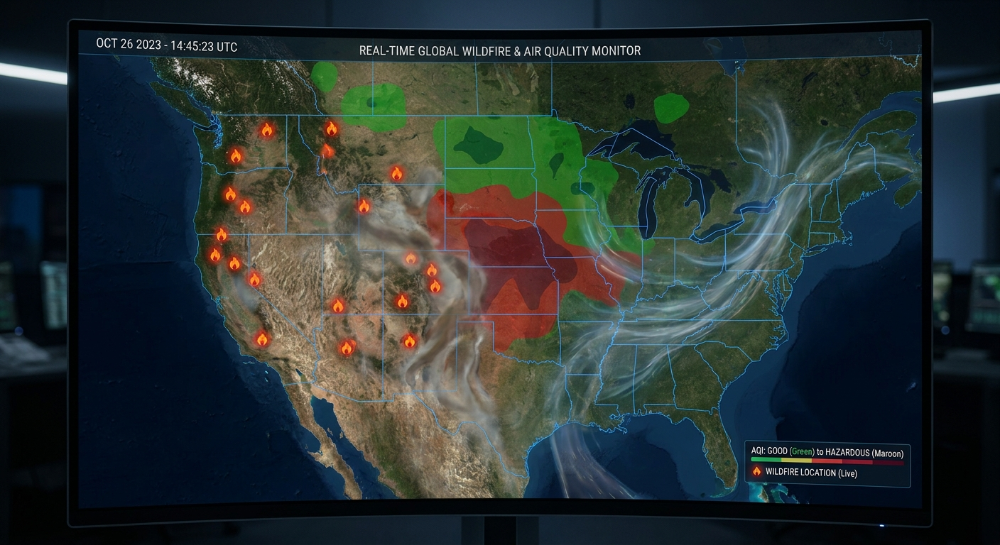

# Should I Go Outside?

A single-page map of North America showing current wildfire perimeters, satellite
heat detections from the last 24 hours, and current air-quality contours. Click the
map (or use your location) and the panel answers in plain English: a verdict line,
the AQI category where you clicked, and the nearest active fire.

Built live during a Data Visualization Society webinar (Aug 2026).

## Run it

No build step. Serve the folder over any static HTTP server (ES modules and the
MapLibre web worker require same-origin):

```sh
python3 -m http.server 8137
# open http://localhost:8137
```

## Stack

- [MapLibre GL JS 6.4.1](https://maplibre.org/) — vendored in `vendor/` because the
  v6 ESM build expects a bundler to inject its web-worker URL (`getWorkerUrl()` is
  `""` by default) and Chrome refuses cross-origin workers from a CDN
- [d3 7.9.0](https://d3js.org/) via CDN — great-circle distance, formatting
- [OpenFreeMap](https://openfreemap.org/) dark basemap — free, keyless

## Data (all live, keyless)

- Fire perimeters: [WFIGS Interagency Perimeters (Current)](https://services3.arcgis.com/T4QMspbfLg3qTGWY/arcgis/rest/services/WFIGS_Interagency_Perimeters_Current/FeatureServer/0)
- Heat detections: [VIIRS Thermal Hotspots](https://services9.arcgis.com/RHVPKKiFTONKtxq3/arcgis/rest/services/Satellite_VIIRS_Thermal_Hotspots_and_Fire_Activity/FeatureServer/0), filtered to `hours_old <= 24`
- AQI contours: [EPA AirNow Latest Contours (Combined)](https://services.arcgis.com/cJ9YHowT8TU7DUyn/arcgis/rest/services/AirNowLatestContoursCombined/FeatureServer/0), `gridcode` = AQI category 1–6

## What did it cost to build?

The whole thing — planning, building, live-debugging the MapLibre worker issue, and
verifying in the browser — was one Claude Code session: **$15.66**.



## The webinar, as heard by a picture frame

A [Whisperframe](https://whisperframe.com) was listening during the webinar and
turned the conversation into art as we went — you can watch the session drift from
audience-map icebreakers into wildfire smoke and honest color. Full gallery
[here](https://whisperframe.com/share/_T-n7l6zq57lkQHbcGkG4), images in
[`whisperframe/`](whisperframe/):

| | |
|---|---|
|  <br> *Global Geography Game Challenge* |  <br> *Forty-Eight Nations Connected* |
|  <br> *Global Data Threads Across Continents* |  <br> *Colors Speaking Truth to Data* |
|  <br> *Fire and Air Digital Landscape* |  <br> *Global Networks Connect Communities Worldwide* |

## The data-viz beat

The EPA AQI palette is the standard — and it is not colorblind-safe. Run it through
a CVD validator against a dark surface and the two most dangerous categories fail
hardest: Very Unhealthy purple lands at 2.76:1 contrast and Hazardous maroon at
1.59:1. So this app never lets color stand alone: every swatch gets a hairline
ring, and the category name and AQI number range are printed next to the color in
the legend, the chip, and the verdict panel.
